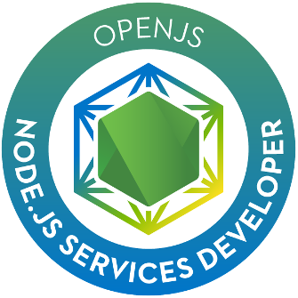
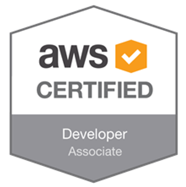

### Hi there 👋

I'm a **Senior Backend Software Engineer** with 6 years of professional experience.
I mostly work with **Node.js** (6+ years) and **TypeScript** (2 years), but also React.js and Python.

I'm a Bachelor of Biomedical Informatics, AWS Certified Developer - Associate, Microsoft Certified Professional and OpenJS Node.js Certified Services Developer (30th person in the world to get this certification).

Some of the technologies/tools I have worked with are:

> Advanced knowledge of Node.js and TypeScript
> Some knowledge of Python, React.js (Material UI), Vue.js, HTML5, CSS3, Bootstrap   
> Development of RESTful APIs with Express.js  
> Databases: SQL (MySQL, PostgreSQL) and NoSQL (MongoDB, Redis, Firebase)   
> Automated tests: jest, mocha, chai, joi, sinon, istambul, stryker   
> Version control: git, gitflow   
> DevOps: Docker, docker-compose, CI/CD   
> Cloud AWS (S3, EC2, RDS, Lambda, API Gateway, CloudFront, Elastic Beanstalk, ECR, ECS), GCP (Cloud Functions, Firebase)   
> Code style & quality: ESLint, git hooks, prettier, AirBnB, StandardJS   
> System Monitoring: New Relic, Papertrail, Kibana, Logstash   
> Message Queues: RabbitMQ, PubSub  
> Agile Methodologies: Scrum, Kanban   
> Agile Tools: Trello, Jira, ClubHouse   
> Other: NLP (Microsoft LUIS), Design Patterns, API Security, SendGrid, Certbot, Keycloak   

You can reach me out on [LinkedIn](https://www.linkedin.com/in/amirelemam) or over email.  

 

